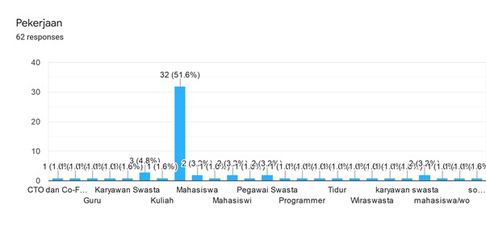
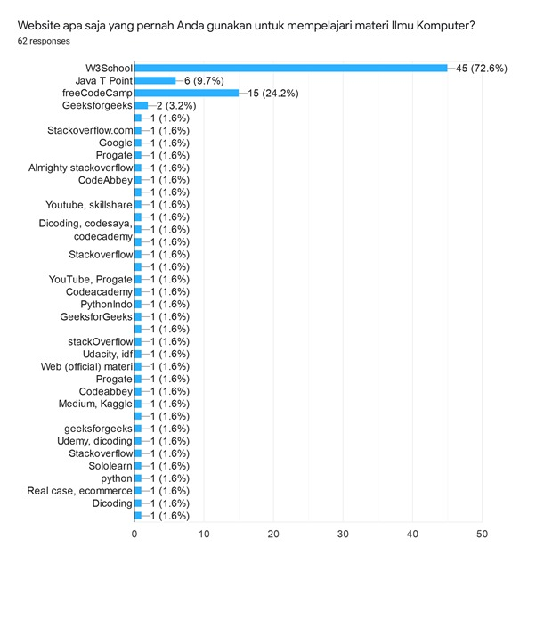
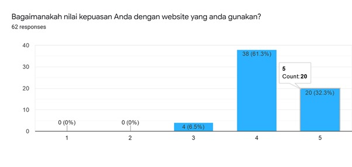
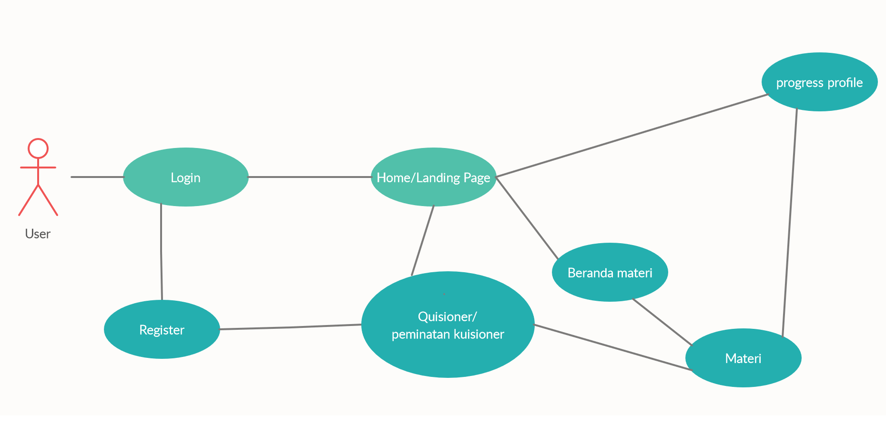

# DevGuide
Have you ever find it difficult for you to learn about your specific subject in computer science ? We do. Subject material are usually spread through the internet and sometimes difficult to search. Also, some article are hard to read or have quite advanced difficulties. 

This DevGuide project is our effort to eliminate these problem. Our project plans to help you consider your carreer path and also give you the right direction on what you need to learn right now and in the future. 

## Charts
### Survey Result

### Usecase Diagram

## Planned Features
### Main Features
- [ ] Code snippets / example
- [ ] Minimal note-taking
- [ ] To-Do for progression
- [ ] Code use case, based on activity
- [ ] Categorization per role

### Targeted Milestone
- [ ] Progression backup
- [ ] Forum Discussion
- [ ] Solution voting
- [ ] Mobile UI

## Our Team
- Akbar Maulana Alfatih ([@MosQyy](https://www.github.com/MosQyy) / 1313619003)
- Farhan Dewanta Syahputra ([@Supiraru](https://www.github.com/Supiraru) / 1313619017)
- Mochammad Hanif Ramadhan ([@etrnal70](https://www.github.com/etrnal70) / 1313619025)
